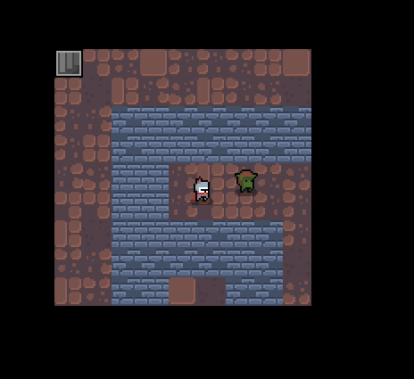

# Explorer
Simple labyrinth solver game, made with SFML library.

Get to the next level of  the labyrinth in the dungeon, while having only limited visibility.
Watch out there is a mean goblin right behind you! 


## Usage

First build the package by running:
```
make
```

Launch the game:
```
./build/src/explorer/explorer
```